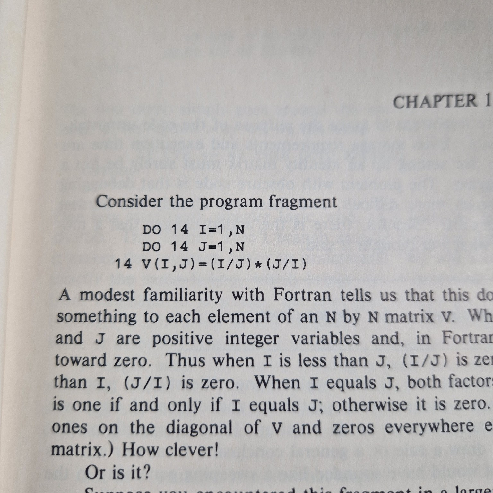
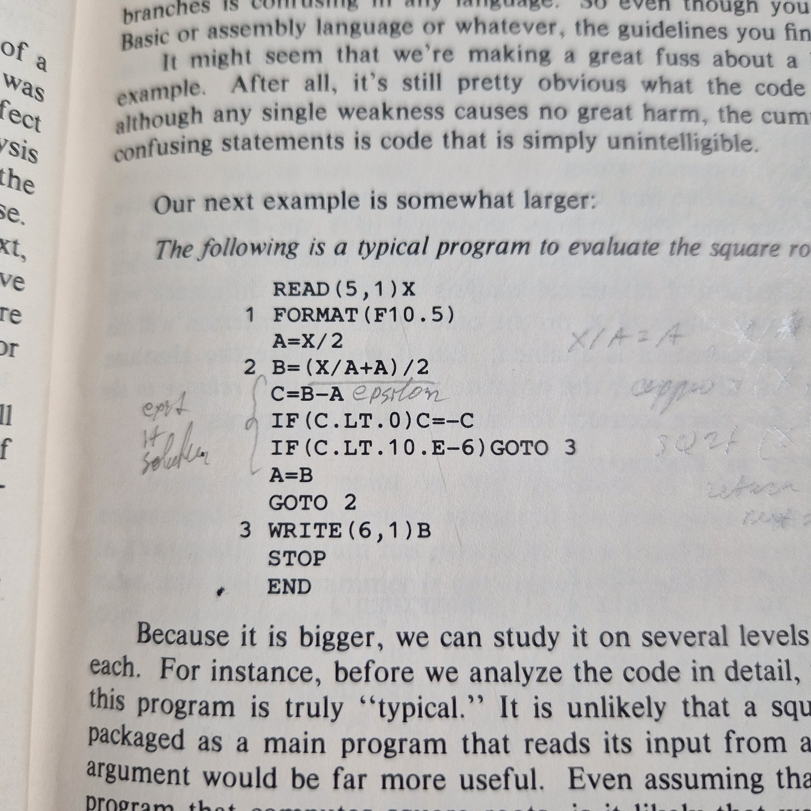
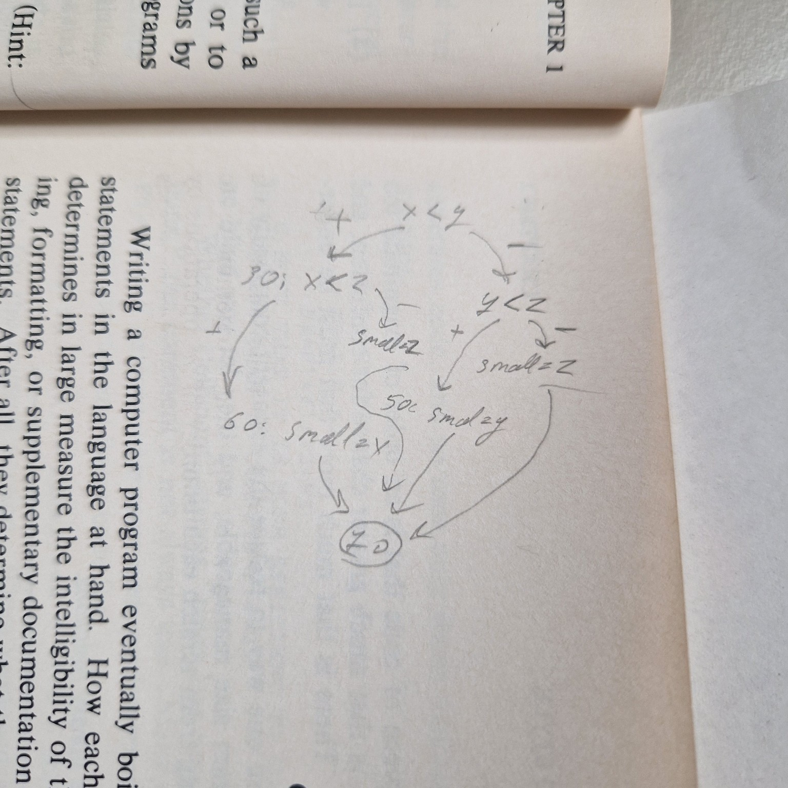

# Reading The Elements of Programming Style by Kernighan and Plauger

| Attribute | Value                               |
|-----------|-------------------------------------|
| Book:     | The Elements of Programming Style   |
| Author:   | Brian W. Kernighan and P.J. Plauger |
| Edition:  | Second Edition                      |
| Years:    | 1978, 1974                          |

## Abstract

The key message of the book: hey, can we write code that we can read afterward?

The book focuses on pushing structural programming concepts and fighting against the use of `goto` statements.

## Why I'm writing this review

To show the key problems of programming in 1970s to compare them with modern programming practices.

To highlight that many programming examples that I have seen being student are actually taken from this period.

To show, which programming problems people being solving in the 1970s.

## Context

The book focuses on [Fortran IV (1962)](https://en.wikipedia.org/wiki/Fortran_66)
and [PL/I (1964)](https://en.wikipedia.org/wiki/PL/I) programming languages.
While also mentioning [Cobol (1960)](https://en.wikipedia.org/wiki/COBOL)
and [Basic (1964)](https://en.wikipedia.org/wiki/BASIC).

From a programing perspective 1970s were the era were dominated by mainframes:

| Computer        | Year | Bits | MIN RAM | MAX RAM | Byte Size | Address Space |   Speed | Wikipedia                                                   |
|:----------------|-----:|-----:|--------:|--------:|----------:|--------------:|--------:|-------------------------------------------------------------|
| DEC VAX         | 1977 |   32 |   128KB |     4MB |     8-bit |           4GB | 500 KHz | [link](https://en.wikipedia.org/wiki/VAX)                   |
| Cray-1          | 1976 |   64 |     8MB |    16MB |     8-bit |          16GB |  80 MHz | [link](https://en.wikipedia.org/wiki/Cray-1)                |
| DEC PDP-11      | 1970 |   16 |     2KB |   256KB |     8-bit |          64KB |   2 MHz | [link](https://en.wikipedia.org/wiki/PDP-11)                |
| IBM 370         | 1970 |   32 |   256KB |     8MB |     8-bit |          16MB |   3 MHz | [link](https://en.wikipedia.org/wiki/IBM_System/370)        |
| CDC 7600        | 1969 |   60 |    32KB |   256KB |     6-bit |         256KB |  36 MHz | [link](https://en.wikipedia.org/wiki/CDC_7600)              |
| IBM 1130        | 1965 |   16 |     4KB |    32KB |     8-bit |          64KB |   1 MHz | [link](https://en.wikipedia.org/wiki/IBM_1130)              |
| UNIVAC 1108     | 1964 |   36 |    32KB |   256KB |     6-bit |         256KB |   1 MHz | [link](https://en.wikipedia.org/wiki/UNIVAC_1108)           |
| Honeywell 6000  | 1964 |   48 |    16KB |   256KB |     6-bit |         256KB |   1 MHz | [link](https://en.wikipedia.org/wiki/Honeywell_6000_series) |
| Burroughs B5500 | 1962 |   48 |    16KB |   256KB |     6-bit |         256KB |   1 MHz | [link](https://en.wikipedia.org/wiki/Burroughs_B5500)       |

Here is why computers listed above were significant at the time:

- `DEC VAX` was a very popular minicomputer line, known for its versatility and the VMS operating system.
- `Cray-1` was one of the first supercomputers, renowned for its speed and vector processing capabilities.
- `DEC PDP-11` was a highly influential minicomputer that helped popularize the C programming language and Unix
  operating system.
- `IBM 370` was a mainframe computer series that introduced virtual memory and was widely used in enterprise computing.
- `CDC 7600` was one of the fastest computers of its time, designed for scientific and engineering applications.
- `IBM 1130` was a low-cost computer aimed at small businesses and educational institutions.
- `UNIVAC 1108` was part of the UNIVAC series, known for its use in business and government applications.
- `Honeywell 6000` series were mainframe computers used in various commercial and scientific applications.
- `Burroughs B5500` was known for its innovative architecture and was used in business and scientific computing.

While microcomputers, such as Apple-II (1977), just started to appear on the market.
Programming for them were limited to [Applesoft BASIC](https://en.wikipedia.org/wiki/Applesoft_BASIC)
and assembly languages. [Apple Pascal](https://en.wikipedia.org/wiki/Apple_Pascal) for Apple II
was only introduced in 1979.

## Making and Identity Matrix

The book starts with a famous example of initializing identity matrix:



```fortran
      PROGRAM BAD
      INTEGER I, J, N
      PARAMETER (N=10)
      REAL V(N,N)
      
      DO 14 I = 1, N
      DO 14 J = 1, N
14    V(I,J) = (I/J)*(J/I)

      PRINT *, 'Diagonal matrix:'
      DO 20 I = 1, N
         PRINT *, (V(I,J), J=1,N)
20    CONTINUE
      END
```

Which produced the following output:

```terminaloutput
 Diagonal matrix:
   1.00000000       0.00000000       0.00000000       0.00000000       0.00000000    
   0.00000000       1.00000000       0.00000000       0.00000000       0.00000000    
   0.00000000       0.00000000       1.00000000       0.00000000       0.00000000    
   0.00000000       0.00000000       0.00000000       1.00000000       0.00000000    
   0.00000000       0.00000000       0.00000000       0.00000000       1.00000000    
```

> Note: all outputs in this review are generated using [OneCompiler](https://onecompiler.com/fortran).

This particular piece of code:

```fortran
      DO 14 I = 1, N
      DO 14 J = 1, N
14    V(I,J) = (I/J)*(J/I)
```

works because of integer division:

- when `I<J` then `I/J` will be `0` and `0` multiplied by anything is `0`,
- when `J<I` then `J/I` will be `0` and `0` multiplied by anything is `0`,
- when `I==J` then `I/J` will be `1` and `J/I` will be `1`, so `1*1` is `1`.

Also, it works badly because:

- the algorithm is build on a side effect of operation (integer division),
- division is an expensive operation that is abused here,
- it seems the goal was to write the shortest code possible (which is a misleading metric).

Meantime, a better version of the same code would be:

```fortran
      PROGRAM GOOD
      INTEGER I, J, N
      PARAMETER (N=10)
      REAL V(N,N)
      
      DO 14 I = 1, N
        DO 12 J = 1, N
12        V(I,J) = 0.0          
14      V(I,I) = 1.0

      PRINT *, 'Diagonal matrix:'
      DO 20 I = 1, N
         PRINT *, (V(I,J), J=1,N)
20    CONTINUE
      END
```

One more important improvement is using indentation to highlight the structure of the code.

## Computing Square Root

Another popular program is a computation of square root using Newton's method. 
Obviously, most of the formulas in physics and engineering use square roots. 
Which makes a need for efficient and accurate square root computation crucial.

Here is a bad version of the code:




```fortran
        PROGRAM SQUAREROOT
        REAL X, A, B, C
        X = 2.0
1       A = X / 2.0
2       B = (X/A+A)/2.0
        C = B-A
        IF (C .LT. 0.0) C = -C
        IF (C .LT. 0.00001) GOTO 3
        A=B
        GOTO 2       
3       PRINT *, B
        STOP
        END       
```    

This code highlights several bad practices:

- lack of trust to compiler. Absolute value is computed manually instead of using `ABS` function.
- lack of display symbols. Instead of `<` and `.LT.` code is used, which is less readable.

Yet the algorithm itself is sound and converges quickly, in comparison to binary search method.

## Finding Maximum of 3 Values
Here is a bad version of finding maximum of 3 values [the code](https://onecompiler.com/fortran/43ynb8y7h):

```fortran
      PROGRAM FINDMIN
      REAL X, Y, Z, SMALL

      X = 12.0
      Y = 7.5
      Z = 9.3

      IF (X .LT. Y) GO TO 30
      IF (Y .LT. Z) GO TO 50
      SMALL = Z
      GO TO 70
 30   IF (X .LT. Z) GO TO 60
      SMALL = Z
      GO TO 70
 50   SMALL = Y
      GO TO 70
 60   SMALL = X
 70   CONTINUE

      WRITE(*,*) 'X =', X, ' Y =', Y, ' Z =', Z
      WRITE(*,*) 'SMALLEST =', SMALL

      END
```

To understand this program you actually need to draw a flowchart. 



And while in case of this particular
program the chart is relatively simple and logical, now you can truly understand the origins of the term
spaghetti code. Just image a little bit longer program with more branches and less symmetry in transition.

# Sorting Routine

```fortran
      DIMENSION N(500)
      WRITE (6,6)
  6   FORMAT (1H1,26HNUMBERS IN ALGEBRAIC ORDER)
      DO 8 I=1,500
  8   READ (5,7) N(I)
  7   FORMAT (I4)
      DO 10 K=1,1999
      J=K-1000
      DO 10 I=1,500
      IF(N(I)-J) 10,9,10
 10   CONTINUE
      STOP
  9   WRITE (6,95) N(I)
 95   FORMAT (1H ,I4)
      GO TO 10
      END
```

## 10.0 Times 0.1 is not 1.0

## Don't compare floating point values for equality

```fortran
      PROGRAM BAD
      REAL X, Y
      X = 10.0
      Y = X * 0.1
      IF (Y .EQ. 1.0) THEN
         PRINT *, 'Y is 1.0'
      ELSE
         PRINT *, 'Y is not 1.0'
      ENDIF
      END
```

